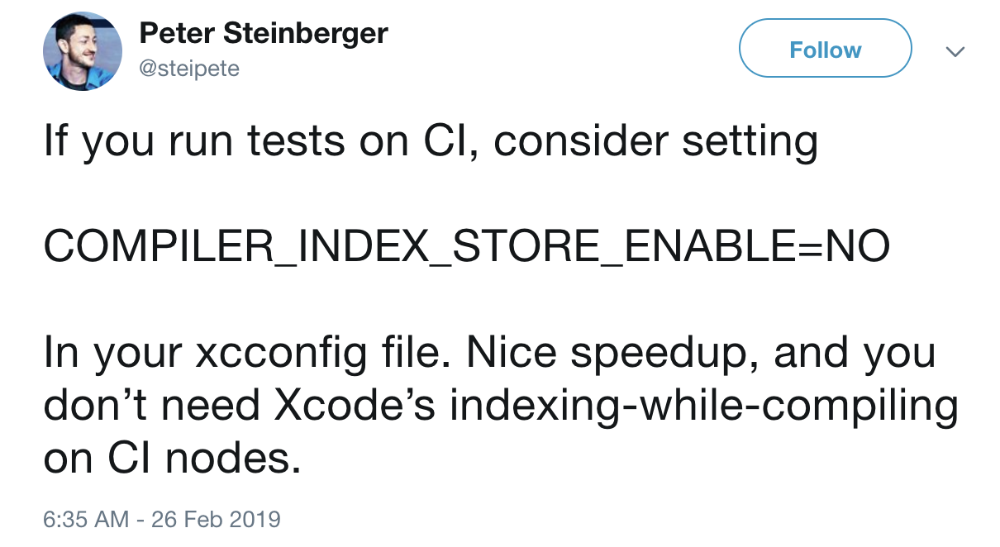

slidenumbers: true

# [fit] Speeding up your CI

---

# Self Intro

- Joshua Kaplan
- minne @ GMO Pepabo
- Danger-Swift contributer
- Likes 🤖

^ 日本最大のハンドメイドマーケットプレイスである minne の iOS エンジニア
本日発表する Danger の contributer
機械に仕事をしてもらうのが好き

---

# [fit] What do we use CI for?

---

1. Automated testing
2. Static analysis (linting etc)
3. Beta deployment
4. Release build deployment

---

# [fit] What were build times like?

---

- 1st build: 55 minutes
- 2nd and later: 35 minutes

---

# [fit] What did they become?

---

- 14-16 minutes

---

# [fit] How?

---

# [fit] Caching frameworks

---

- Moving to Carthage and using [Rome](https://github.com/blender/Rome)
- Biggest impact: 55 to 33 minutes

---

# [fit] What is Rome?

^ Rome is a tool that uploads and downloads prebuilt binaries from Carthage to a variety of storage services. I use AWS S3 because it's popular and cost effective (less than 3,000 yen per month)

---

# [fit] Upgrading plan

---


---

- Not much to explain here
- 33 to 20 minutes

---

# [fit] Only getting code coverage when tests change

---

- 2 minutes less

---

# [fit] Remove pointless indexing

---



---

- Saves 1 or 2 minutes

```sh
COMPILER_INDEX_STORE_ENABLE=NO
```

---

# [fit] Other techniques I look forward to

---

- Parallelization
- Separate modules

^ Parallelization: run static analysis at the same time as building + testing. Separate modules means better caching for incremental builds. xcode's build system has to be conservative for what really needs to be rebuilt to avoid dangerous mistakes

---

# [fit] Conclusion

---

# [fit] Mess around
